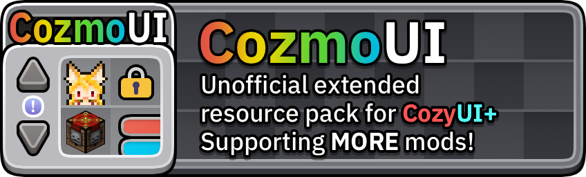
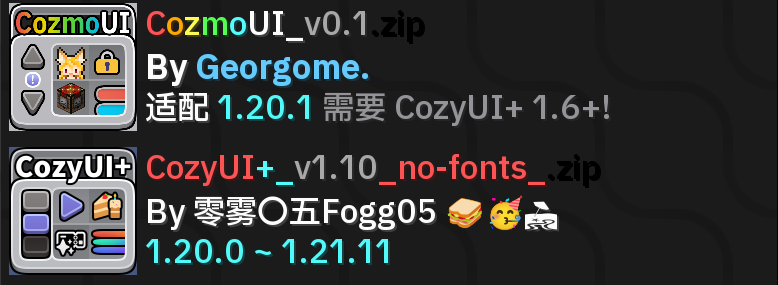
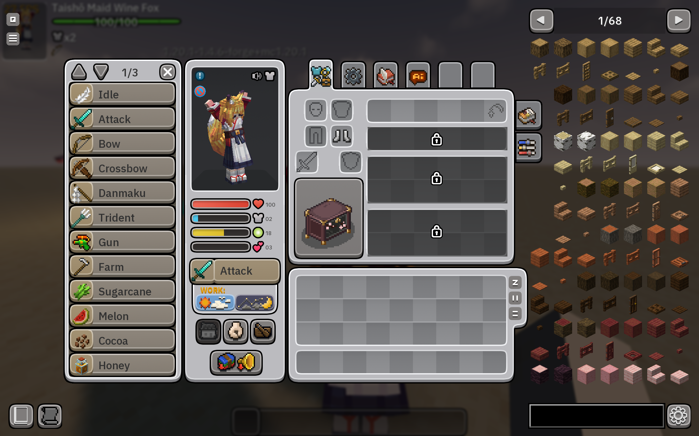
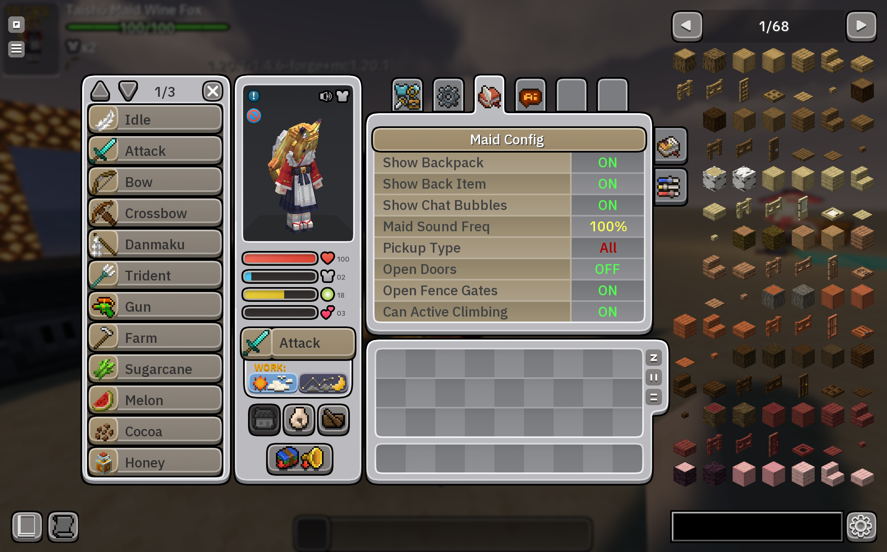
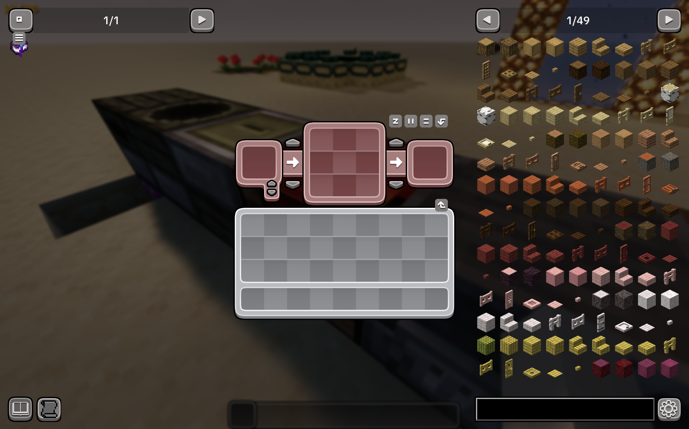
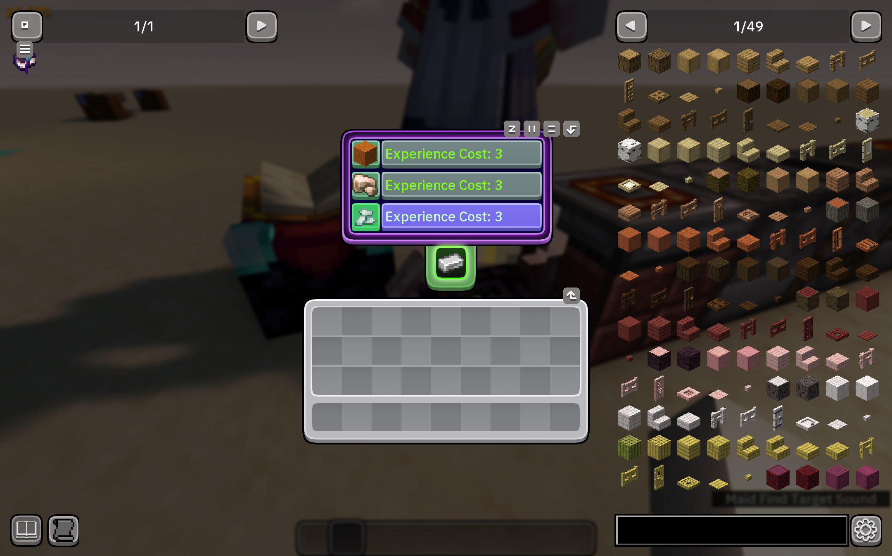
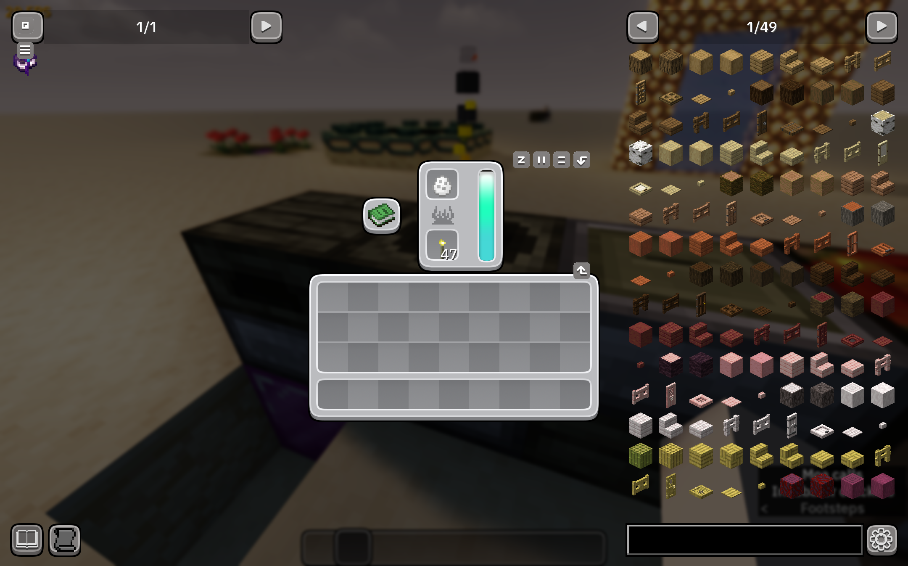

# CozmoUI
An unofficial extended resource pack for CozyUI+.  

> [!CAUTION]
>
> This resource pack is still in progress, and some details may not be handled very well. Please forgive!😥

> [!IMPORTANT]
> This pack currently only supports Minecraft 1.20.1.  
## 🖊️  PACK DESCRIPTION 🖊️ ##
This resource pack covers CozyUI+ into more mods, such as The Twilight Forest, The Aether, Touhou Little Maid and so on.  
Please download [CozyUI+](https://modrinth.com/resourcepack/cozyui-plus) first and load this pack above CozyUI+ to work correctly.  
  
> Load the resource packs like this.

## ⭐ COVERED MODS ⭐ ##
| Mod Name 模组名称             | Mod Version 模组版本               | Home Page Link 模组链接              | Pack Version 包版本           |
|:---------------------:|:---------------------:|:---------------------:|:---------------------:|
| Alex's Mobs              | 1.22.9               | [🔗CurseForge](https://www.curseforge.com/minecraft/mc-mods/alexs-mobs)             | v0.1           |
| Maid Addition           | 1.1.4-beta              | [🔗CurseForge](https://www.curseforge.com/minecraft/mc-mods/maidaddition)              | v0.1           |
| The Aether          | 1.5.2              | [🔗CurseForge](https://www.curseforge.com/minecraft/mc-mods/aether)              | v0.1           |
| The Twilight Forest | 4.3.2508 | [🔗CurseForge](https://www.curseforge.com/minecraft/mc-mods/the-twilight-forest)  | v0.1           |
| Touhou Little Maid | 1.4.6 | [🔗CurseForge](https://www.curseforge.com/minecraft/mc-mods/touhou-little-maid)  | v0.1           |~~~~

## 🖼️ SAMPLE PICTURES 🖼️ ##
>     
> Maid GUI in *Touhou Little Maid*  

>     
> Maid config GUI in *Touhou Little Maid*

>     
> Uncrafting table in *The Twilight Forest*

>     
> Incubator in *The Aether*

>     
> Transmutation table in *Alex's Mobs*


## 😎 SPECIAL THANKS 😎 ##
- Fogg05: the original creator of [CozyUI+](https://modrinth.com/resourcepack/cozyui-plus), RIP 2025

- WhatDamon: the creator of [CozyUI Ex](https://modrinth.com/resourcepack/cozyui-ex)

- TartaricAcid: the creator of [Touhou Little Maid](https://www.curseforge.com/minecraft/mc-mods/touhou-little-maid)

- IBM: providing the [Plex Sans font](https://github.com/IBM/plex)

- MaokenFont: providing the [Frex Sans font](https://github.com/maoken-fonts/frex-sans)

- Microsoft: providing the [Fluent Emoji](https://github.com/microsoft/fluentui-emoji)

## 📜 LICENSE 📜 ##
Licensed under 
```GNU GENERAL PUBLIC LICENSE Version 3```.  
